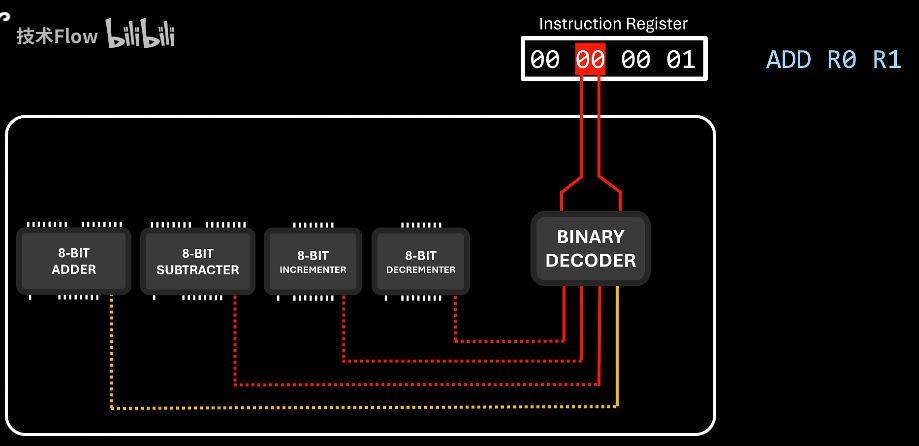

[toc]

## 1.晶体管

晶体管的基本作用：通过电流来控制电流

晶体管可以看作一个开关，不过不是机械开关，而是电开关，当base通电时，来自Collector的电流可以通到Emitter，不通电时就无法导通。

## 2.逻辑门

两个晶体管串联就是与门，并联就是或门。

以下的门都可以用晶体管连成。

## 3.半加器，全加器

半加器，二位加法器，只能处理二位加法，不可以处理先前加法的进位。

sum由异或门组成，carry由与门组成。

全加器，三位加法器，不仅可以处理二位加法，还可以处理先前加法的进位

## 4.八位加法器，减法器

由8个全加器组成，可以计算1B大小数据的加减。

减法器：A - B = A + （-B）

## 5.二进制解码器

可以将通过n个位控制输出2^n个中的一个

## 7.指令的解读方式

ADD R0 R1，对应00 00 00 01，

前面的00表示什么种类的运算符，00表示算术运算。

第二个00表示是什么运算符，这里表示ADD

第三个00表示R0，

第四个01表示R1.

第二个00会连接解码器，转化为对8位加法器的控制。

上面的即可抽象为下面的ALU。

